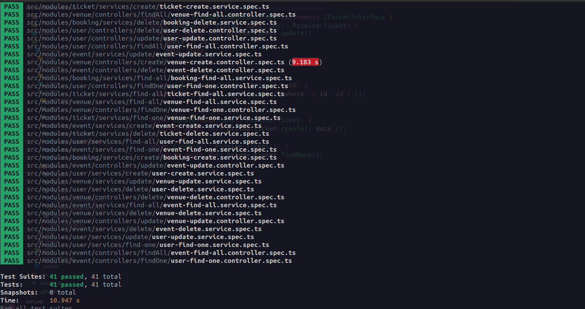

# event-managent-api


## Descriçãp
Este repositório contém a implementação de uma API  de gestão de eventos, desenvolvida para facilitar a criação, gerenciamento e participação em eventos. A API conta com 5 modulos e oferece funcionalidades para criar eventos, registrar participantes, gerenciar inscrições. O projeto é parte de um exame acadêmico e foi desenvolvido utilizando as seguintes tecnologias: Nestjs, Typescript, Prisma e PostgreSQL. 


## Instalação

```bash
$ install -g @nestjs/cli

```


```bash
$ yarn install
```

## Rodar a aplicação

```bash
$ yarn run start

```


Como forma de garantir que a aplicação tenha o comportamenteo esperado, escrevi testes unitários


## Rodar Testes unitário

```bash
$ yarn run test
```

## License

Nest is [MIT licensed](LICENSE).
